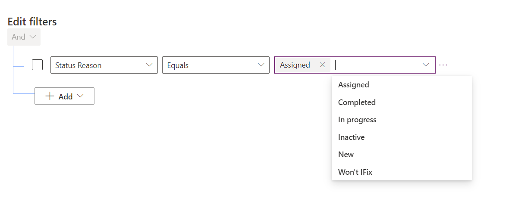
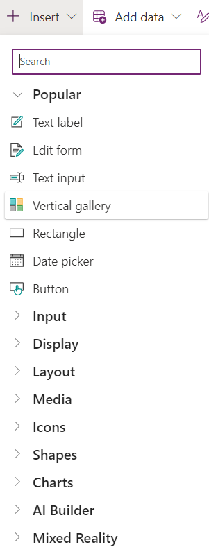

# Scenario
In an office named Retco, where getting work done is really important,
there\'s a person in charge of the employees called the HR manager. This
manager\'s name is Mark.

He is facing a big problem. Many employees want to take some time off
from work, like a vacation, and they need their requests to be handled
quickly. But right now, the way they do it with papers and then fill in
excel sheet also signatures is very time consuming and they keep making
mistakes. Mark is feeling very tired and annoyed because of this. He
really wishes there was a way to make things easier.

Then he start to do research on how to automate his paper walk tasks
using Microsoft 365 and found that he can build an application using
power app with the capability of getting the data from any resource or
creating a new table in technology called DataVerse.

When Mark hears about this, he gets really excited. He starts to build
the application in Power App canvas where employees can ask for time off
making Mark's job easier This program could make everything smoother and
easier for everyone in the office.

## In this Lab you will learn:

**Task 1**: &bull; How to build table in Dataverse?

**Task 2**: &bull; How to build canvas app for leave request by using a table from DataVerse

**Task 3**: &bull; Editing canvas app template(Optional Lab)


 **Notes: Sign in to Dataverse using the email and password provided to you.**


# Task 1: How to build table in Dataverse?

### Step 1: Sign in to Power Platform
 

1.  Open a web browser and navigate to https://admin.powerplatform.microsoft.com/environments

2.  Sign in using you're a new Microsoft account that you want to use
    for this training

3.  Once signed in, click on \"Environments\" in the left navigation menu.

### Step 2: how to setup a new environment

1.In the Apps section, create a new environment:

2: Select **Environments** from the site navigation and select **+
New** from the toolbar

3: For **Name**, enter **\[your initials\] Practice**.
(Example: GL Practice)

4: For **Type**, select **developer**.


5: After choosing **Developer** type ensure that **Add a Dataverse data store** is grayed out similar to the screenshot below.


6: Select **Next**, on the next page select **Save**.

7: In the list of environments, your **Practice** environment should now
show as **Preparing**.


Your practice environment will take a few minutes to provision.
Refresh the **Environments** list if needed.

8: When your environment shows as **Ready**, select
your **Practice** environment by selecting the ellipses next to the
name to expand the drop-down menu and select **Settings**.

### Step 3: Create publisher and solution

0: Navigate to the https://make.powerapps.com/ portal page and make sure you are in the correct environment.

1: Make sure you are in the created **Environment**.


2: From the left navigation pane, select **solution** and then select **+ New
solution**.

3: For **Display name**, enter **Company311**

4 : Select **+ New publisher**, under the **Publisher** field.


5: Enter Leave request for **Display name**, **leaverequest** for
**Name**, **lr** for **Prefix**, **88186** for **Choice value prefix** and
select **Save**.


6: Select **Leave request (leaverequest)** from the **Publisher**
dropdown menu

7: Select **Create**.


### Step 4: Create Tables


1: Inside the **solutions** window, select **+ New** \> **Table** \> **Table**.

2: Enter leave request for **Display name** and select **Save**.


### Step 5: Define Table and Add Columns

1:On the left panel expand on  **Leave request** Table.


2: There are many ways to add a new column to the table. For this lab,
select **+ New**, then select **Column** from the Schema group.


3: Enter Notes for **Display name**. Select **Text \> Multiple line of
text \> Plain text** for **Data type**.


4: Your **page** should look like the image below.


5: Ensure that the **Maximum character count** is 2000, in the **Advanced options** section, then select **Save**.


6: Select **+ New \> Column** from the top menu.

7: Enter **Reason** for **Display name**, select **Text \> Multiple
lines of text \> Plain Text** for **Data type**,and select **Save**.


8: Select **+ New \> Column** again.

9: Enter Duration for **Display name**, select \> **Whole Number** for
Data type,  and click on  **Save** 

10: Select **+ New \> Column**.

11: Enter Leave type for **Display name**, select Text \>**Choice**
for Data type\>select **New choice** in **Sync this** **choice** with
and create new choice.


12: Select **+ New choice** and enter Sick Leave for **Label**.

13: Select **+ New choice** and enter Maternity Leave for **Label**.

14: Select **+ New choice** and enter Vacation Leave for **Label**.

15: Select **+ New choice** and enter Bereavement Leave  for **Label**.

16: Your page should look like the image below.


17: In **Sync this choice with** select **Leave type** then click  **Save**


18: Select **+ New \> Column**.

19: Enter Created By for **Display name**, select **Single line of
text** for **Data type,** and select **Save**.

20: Select **+ New \> Column**.

21: Enter Comment for **Display name**, select **Multiple line of
text** for **Data type,** and select **Save**.

22: Select **+ New \> Column**.

23: Enter From for **Display name**, select **Date and time** for
**Data type,** and select **Save**.

24: Select **+ New \> Column**.

25: Enter To for **Display name**, select **Date and time** for **Data
type,** and select **Save**.

26: Select **All** from the tree view in the **Objects** pane.


27: Select **Publish all customizations** from the command bar and wait
for the publishing to complete

### Step 6: Edit Status Reason Choice

In this task, you will edit the Status Reason column of the Leave
    Request table.

1: Make sure you are in the **Company 311** solution.

2: In the **Objects** navigation tree expand **Tables**,
expand **Leave request**, select **Columns**. Locate and select
the **Status Reason** column.


3: Change the existing label for the **Active** option to New

4: Select **+ New choice** and enter Assigned for **Label**.

5: Select **+ New choice** and enter In Progress for **Label**.

6: Select **+ New choice** and enter Completed for **Label**.

7: Select **+ New choice** and enter won't fix  for **Label**.

8: You should now have 5 options. Verify the **Default choice** is set
as **New** and select **Save**.


9: Select **All** from the tree view in the **Objects** pane.


10: Select **Publish all customizations** and wait for the publishing to
complete.

### Step 7: Configure form and views


1: In the **Objects**  left navigation tree expand **Tables**,
expand **Leave request** table.

2: Select the **Forms** tab and open the **Information** form of
type **Main**.


3: Click on **General** tab to access for the **properties**.


4: Go to the **Properties** right pane, change the **Label** to Leave Request and type  **section_Leave_request** for **Name**.


5: From the left columns options click on the **duration**, and **notes**  to add them to the form.


6: Your form should now look like the image below. Select the **Notes** Column.


6: Go to the **Properties** pane and expand the **Formatting** section.

7: Change the **Form field height** to **4 rows**.


8: Select **Save and Publish**  from the top of the page

9: Wait for the publishing to complete.

10: Your form should now look like the image below. Select **Save and
publish**.


11: Select the **🡠 Back** button to return to the **Solution Explorer**.

### Step 8: Editing View

1: In the **Leave Request** table,select **Views**.


2: Open the **Leave request Advanced Find View** view.


3: Select **status reason** in the **Table columns** list to add the 
column to the view.


4: Select **Leave type, Reason**, and **From, To**, **Duration** columns to
add them to the view.

5: Go to the view **Properties** pane and select **Edit filters**.


6: Select **+ Add** then click on **Add row**.


7: Select Status Reason from the selection Pane.


8: Expand the values drop-down with Status Reason values
where **New** is selected.



9: Select **Assigned**.

10: Select the drop-down again and select **In Progress**.

11: The filter should now look like the image below. Select **Ok**.


12: Select **Save and publish**.

### Step 9: Create view from

1: Select **Edit filters**.


2: Remove In **Progress** from the filter.


3: Remove **Assigned**, then remove **New** value form the filter.

4: Select the drop-down list, then select **Completed**.


5: Add **Won't Fix** and **Inactive** values to filter.

6: The filter should now look like the image below. Select **Ok**.


**7:** Select the  publish button and wait the request to finish.


**8:** Select the **🡠 Back** button to return to the solution explorer.


**9:** Select **All** in the **Objects** navigation tree.

10: Select **Publish all customizations** and wait for the publishing to
complete.

# Task 2: How to build canvas app for leave request by using a table from DataVerse

### Step 1: Create your first screen in Power App canvas Phone.

1: Navigate to the https://make.powerapps.com/ portal page and make
sure you are in the correct environment.

2: Select **Solutions** and open the **Company 311** solution.

3: Select **+ New** \> **App** \> **canvas app**.


4: Enter **Company 311 Phone App**, select **Phone** for format, and
select **Create**.

5: Select **Skip**.


6: In the **Tree view**, select the three dots menu for **Screen1** and
select **Rename.**

7: Rename the screen to **Welcome Page**


 

8: Select the **Welcome Page Screen** and then select **+ Insert** from the left
navigation pane.


9: select the **Main Screen** and then select **+ Insert** from the
left navigation pane and add a **rectangle** to your screen.


10: After adding the rectangle to your page, reselect the **+ Insert**
from the left navigation and add **Text label** to add a **title** to
your page.


11: Your page should now look like the image below. Click **Save** to
save it.


 ### Step 2: Adding image to your page

1: Open the **App** you created.

2: Select the **Main Screen** and then select **+ Insert** from the
 left navigation pane, choose **Media** and select **Image**.


3: Select the **Image** u added, go to the **Properties** pane, and
change the **border radius** to **35,** navigate to the image property
and enter the following code in the function section.


Copy the below code in the function box:

``` 
User().Image (Make sure that your are selected the image property)
``` 


4: Your page should now look like the image below. Click **Save** to
save it.


 ### Step 3: User function in Power Apps


1: Open the **App** you created.

2: Select the **+ Insert** from the left navigation to add a **Text
 label** in the middle of your page for the user function.


3: After inserting the **Text Label** give it the following **code**
 to export User name automatically.


Copy the below code in the function box:

``` 
Code function: "Welcome " & User().FullName (Make sure your located in the text property)
``` 


4: Your page should now look like the image below. Click **Save** to
save it.


5: Select the **+ Insert** from the left navigation to add **2
button** under each other for the **submit** and **View** your leave
request.

6: Your page should now look like the image below. Click **Save** to
save it.


 ### Step 4: Creating Your Home Page

1: Open the **App** you created.

2: Select New screen and click on Blank to create a Blank Page and name it as Home Page.


3: Select the **+ Insert** from the left navigation to add a
**Rectangle** with a **Text Label** for the title.

4: Select the **+ Insert** from the left navigation then add an Arrow
Left from **Icon** section to navigate to the Welcome Page.

Function code for Arrow Left: Navigate(Your first created page) =\>
**Navigate('Welcome Page').**

5: Your page should now look like the image below. Click **Save** to
save it.


6: Select the **+ Insert** from the left navigation to add an **Edit
Form** and connect it to your **DataVerse** table.


7: After adding the new form go to **Properties Pane** select **Data
source** and then click on the table u created.


8: Your **form** will automatically generate using the **table** your
page should now look like the image below. Click **Save** to save it.

9:  Select the + Insert from the left navigation to add an **Button** and name it as **Submit**.

10: Your page should now look like the image below.


11: Select the **Form** you created go to **Properties Pane** select
Fields and make sure you added **duration**, **Reason**, **Leave**
**Type**, **From** and **To** columns.

Notes: Go to **Form Function** select **Default Mode** from
**Property** and add the following **code** to display the form in
your screen

Copy the below code in the function box:

``` 
FormMode.New
``` 


12: Select the **Duration** column and insert the following **code**
in the function box to make the difference between the **dates**.


Copy the below code in the function box:

``` 
RoundDown(DateDiff(DateValue1.SelectedDate,DateValue2.SelectedDate) / 7, 0) * 5 + Mod(5 +Weekday(DateValue2.SelectedDate) - Weekday(DateValue1.SelectedDate),5)+1
```

13: Your page should now look like the image below. Click **Save** to
save it.


14: Select the **Submit** button and insert the following **code** in
the function box above.

Copy the below code in the function box:

``` 
SubmitForm(Form1);Set(VarRdays,VarRdays-DataCardValue5.Text);ResetForm(Form1);Navigate(SuccessScreen) 
``` 

15: After adding the code, select **save** , go to your **Table**, select the **Name** columns  and change make the **required** section to **optional** and click **Save**.


### Step 5: Creating the navigation screen for the submit button

1: In the **Tree View** click on **New screen** and select **Templates**
then **Success** Page.


2: Select on the screen and name it as **SuccessScreen**.


3: Add it to your page, then go Select the **+ Insert** from the left
navigation to add an **Button** and named it as **Back to Welcome Page**
then enter the **code** in the function box to **Navigate.**

Copy the below code in the function box:

``` 
Navigate('Welcome Page')
```  

4: Your page should now look like the image below. Click **Save** to
save it.


## Step 6: Creating the view page for your Leave Request

1: In the **Tree View** click on **New screen** and click on **Blank** Page, and name it as **View Page**.

2: Select the **+ Insert** from the left navigation to add a
**Rectangle** with a **Text Label** for the title.

3: Select the **+ Insert** from the left navigation then add an Arrow
Left from **Icon** section to navigate to the Welcome Page.

Copy the below code in the function box:

``` 
Back()
``` 

4: Your page should now look like the image below. Click **Save** to
save it.


5: Select the **+ Insert** from the left navigation to add a
**Vertical Gallery** to **view** your leave requests.




6: After adding the gallery go to **Properties** select **Data
source** and change it to **Leave request** table, then change the
**Views** section to the view you created bevor.


7: After adding the **Data source** from **Properties** section,
select **Layout** and click on **Title and Subtitle**.


8: Select **Publish all customizations** and wait for the publishing
to complete and your app goanna be ready to use.

9: After publishing your customizations, click on  **Field** pane and change the columns  and add, **Leave type**, and **Duration** by selecting the row from the screen.


10: **Notes**: When your done creating your app, go to the welcome page and add the **code** below for the 2 **button**:

Copy the below code in the function box:

``` ```
Submit button: Navigate('Home Page')
``` ```

``` ```
View button: Navigate('View Page')
``` ```

## Congratulations, you've successfully completed all the tasks in this lab. 
##  In case you still have time you can now start with your optional lab. Great job!"

# Task 3 : Optional Lab (In case you still have time).

## Step 1: Editing canvas app template

1: Select **+ Create** scroll to the down of the page and select
**Leave request Template.**


2: Open it and change the **App name** to **Leave request**, then
select **phone** and click **create**.


3: After **Accessing** the app you can right now customize it by using
the **+ Insert** from bevor, or the property pane by changing the
background image.


4: Select **Background image** and choose the **image** you want to
add it.

5: Go to **Home Page** screen, click on the **+ Insert** from bevor of
the page and add a **button** down to navigate to the
**NewRequestScreen**.

6: Your page should now look like the image below. Click **Save** to
save it.


7: Enter the following **code** to navigate to the **screen**
selected.


Copy the below code in the function box:
``` 
Function: Navigate(NewRequestScreen)
``` 
## Step 2: Create a new screen by using templates

1: Select from bevor **New Screen** and choose **Scrollable** screen
to make a scrollable **gallery**.


2: Change the **background color** by clicking **Property** then
**Background Image** and select the image you want to add.

3: Select + **Insert** from the left navigation bar and add a
**gallery** by importing the table from your **Dataverse**.


4: Select the **Gallery**, go to **property** and select **Data
source** then choose **RequesterBalanceCollection** to bring all the
leave requests.


5: Select **+ Insert** from the **left navigation** and add a
**button** to go back to the **previous page.**

**Function: Back()**


6: Your page should now look like the image below. Click **Save** to
save it.


<br><br><br>

## Congratulations, you've successfully completed all the tasks in this lab. You can now test your lab to ensure that everything functions as expected. Great job!" 
